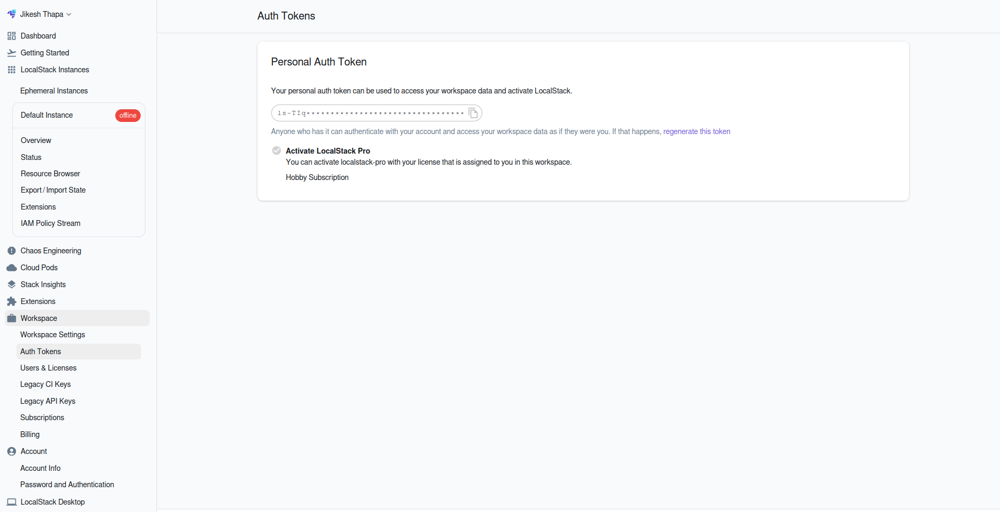
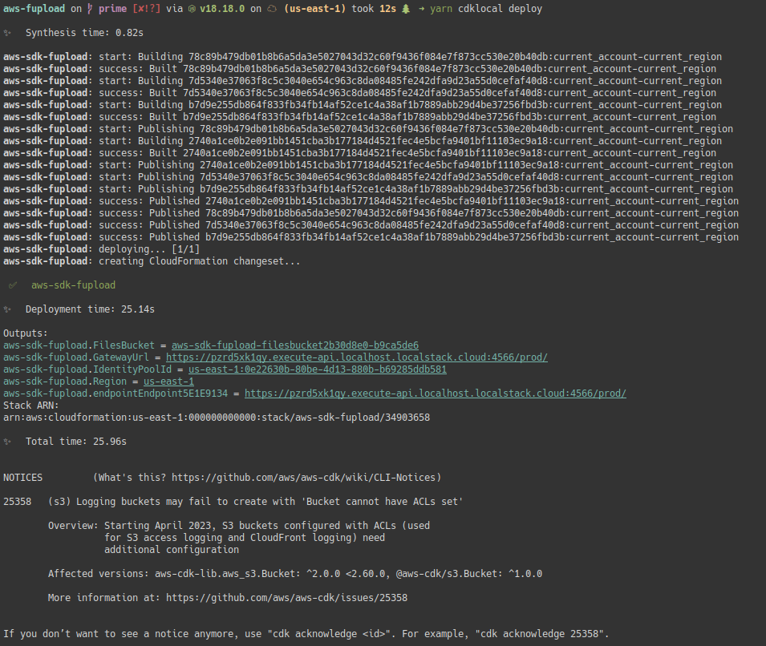
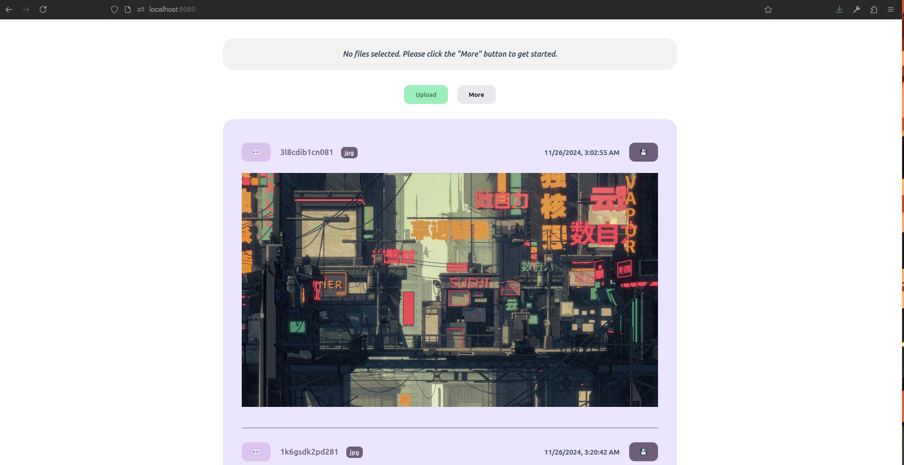

# File Upload Application with Cloud Native Architecture

Leveraging AWS features to create an application that uploads file to a S3 bucket and stores file metadata on a DynamoDB table.

The project was developed to work with Localstack, and here are the instructions to run the application locally.

## Setup LocalStack

Step 1: Installing LocalStack
```bash
curl --output localstack-cli-4.0.0-linux-amd64-onefile.tar.gz \\n    --location https://github.com/localstack/localstack-cli/releases/download/v4.0.0/localstack-cli-4.0.0-linux-amd64-onefile.tar.gz

sudo tar xvzf localstack-cli-4.0.0-linux-*-onefile.tar.gz -C /usr/local/bin
```

Step 2: Check Installation
```bash
localstack --version
```

Step 3: Create a LocalStack account and get the auth token.

> Once the LocalStack instance is up and running, access the dashboard using the displayed URL. Copy the generated auth token as shown in the screenshot.



Step 4: Configure up auth token
```bash
localstack auth set-token <auth-token>
```

Step 5: Start LocalStack
```bash
# Avoid CORS Issue
EXTRA_CORS_ALLOWED_ORIGINS=* localstack start

# Or if you have the local domains figured out
localstack start
```

## Setup and Deploy Application

Step 1: Install requirements
```bash
npm i -g aws-cdk-local aws-cdk
pip3 install awscli-local
```

> Setup AWS CLI by updating the config at ~/.aws/config. Set the region as us-east-1

Step 2: Build and Deploy the application
```bash
cd ~/<project>/<folder>
yarn install
yarn build:backend
yarn cdklocal bootstrap
yarn cdklocal deploy
```

Step 3: Update Web App configuration
> Localstack configuration is displayed as shown after the backend is deployed. Copy the configuration from there to the `config.ts` inside the frontend package.




Step 4: Launch the frontend application
```bash
yarn start:frontend
```

> Now you should have your application up and running as seen below


## Known Issues

1. CORS Error on upload or delete
Sometimes the application may show CORS errors on complex HTTP requests, just remember to put the 'EXTRA_CORS_ALLOWED_ORIGINS=*' before starting the LocalStack instance

2. Ephemeral state
Since LocalStack has ephemeral state, all your instances and uploads will be erased once the LocalStack instance is shutdown.

3. AWS CLI Local
In arch based distributions, `awscli-local` package refueses to install sometimes, this can be replaced with the regular AWS CLI but configurations must be updated inside `./aws/config` to ensure that the resources utilized the AWS CLI are local not remote

4. Identity Service